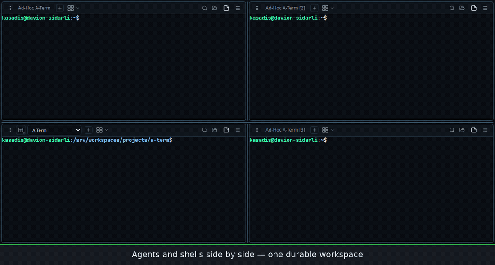

# A-Term

A-Term is a persistent browser workspace for people using AI coding CLIs and shells. It puts tmux-backed terminals and project files side by side, keeping sessions alive when the browser closes so work can resume on reconnect.



## What it does

- Runs Claude Code, Codex, Antigravity, Pi, shells, and configurable TUI tools in up to six resizable panes.
- Provides file browsing and validated uploads, terminal search, scrollback, and mobile controls.
- Supports pane pop-outs, project switching/deep links, themes, and PWA installation.
- Discovers compatible external tmux sessions, including Aico's historical and catalogued server generations.

## Current scope

The supported install targets Linux with systemd. A-Term runs standalone with a local project list. Agent Hub prompt cleaning and the SummitFlow project catalog are optional companion integrations; the wider public companion path is planned for a later release.

## Getting started

```bash
git clone https://github.com/elias-leslie/a-term.git
cd a-term
bash scripts/install.sh
```

Open <http://localhost:3002>. The installer sets up dependencies, PostgreSQL, migrations, frontend output, and user services, and creates local configuration. Source requirements include Python 3.13+, Node.js, pnpm, uv, and tmux. Install smoke tests without a user systemd session can use `bash scripts/install.sh --skip-systemd`.

## Runtime, data, and integrations

FastAPI uses port 8002 and Next.js uses port 3002 by default. PostgreSQL stores application data; tmux owns persistent terminals. Set `SUMMITFLOW_API_BASE` to read projects from SummitFlow instead of the local list.

Default authentication is loopback-only `none`. Before exposing A-Term beyond localhost, use built-in password authentication or `proxy` mode behind an identity-aware gateway. Agent Hub adds optional model catalog and prompt refinement; browser speech input can work independently. Aico catalog rows are read-only and count as live only after a successful tmux query.

## Development and verification

```bash
st pulse --gate
st check --quick --changed-only
```

For public source development, [CONTRIBUTING.md](CONTRIBUTING.md) lists pytest, Ruff, Ty, frontend lint, TypeScript, and Vitest checks. The [project guide](docs/project-guide.md) retains advanced configuration, daily commands, and feature details. Session survival and rendering behavior need runtime verification in addition to those checks.

## Documentation

- [Project guide](docs/project-guide.md) and [remote access](docs/remote-access.md).
- [Contributing](CONTRIBUTING.md), [releasing](RELEASING.md), and [changelog](CHANGELOG.md).
- [Security reporting](SECURITY.md), [Apache 2.0 license](LICENSE), and [notice](NOTICE).
- [Releases](https://github.com/elias-leslie/a-term/releases) and [sponsorship](https://github.com/sponsors/elias-leslie).
