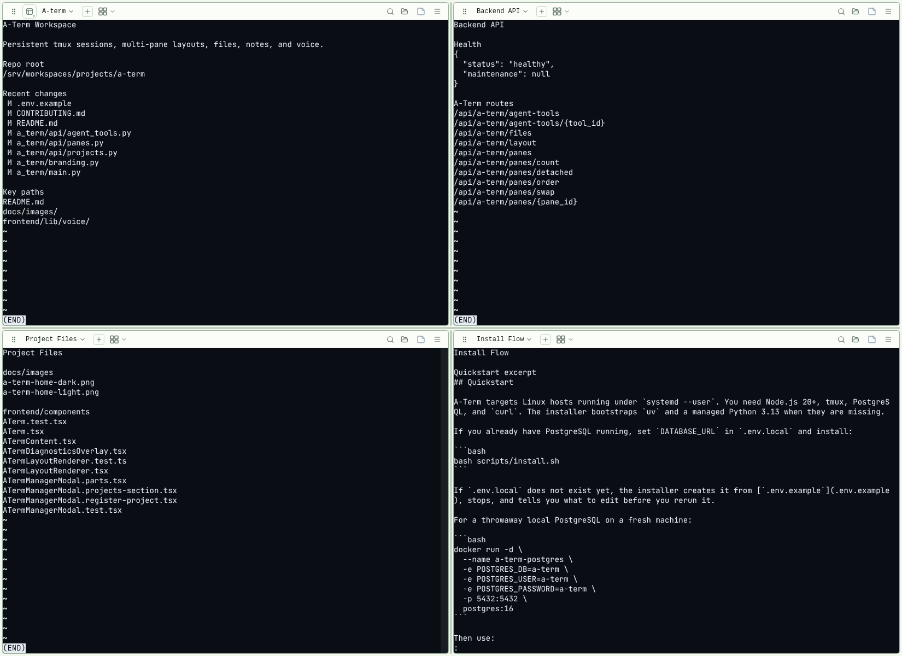
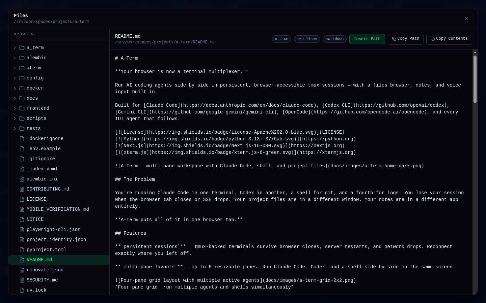
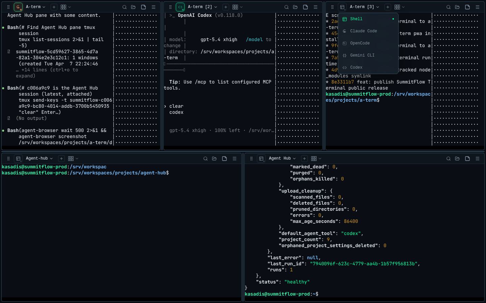

# A-Term project guide

[Project overview](../README.md). This guide retains detailed setup, operating contracts, and verification notes. Run shell commands from the repository root unless a step changes directory.

## Quickstart

```bash
git clone https://github.com/elias-leslie/a-term.git
cd a-term
bash scripts/install.sh
```

Then open **http://localhost:3002** and start working.

A-Term currently targets **Linux with systemd** and needs **Tether**, the local session daemon that owns the terminal sessions (API version 1 or newer, normally `tether@default.service`). Install and start Tether first; the installer stops with a clear message if it cannot reach it. The installer then sets up `.env.local`, Node.js, corepack, Python, uv, tmux, dependencies, frontend build output, and user services. There is no database server to install.
The first install can take a few minutes because it downloads the pieces it needs for you.

Projects come from Tether: SummitFlow's catalog when SummitFlow is installed, otherwise Tether's local list (`~/.config/tether/projects.json`), which A-Term's "Register project" adds to.

If the default ports are already taken, the installer should guide you to another open port instead of forcing you to debug it by hand.

Most people can stop here. The advanced setup options are lower on the page.

Want the latest shipped changes? See [Releases](https://github.com/elias-leslie/a-term/releases) and the [Changelog](../CHANGELOG.md).

## Features

**`persistent sessions`** — Sessions live in Tether, not in A-Term, so they survive browser closes, A-Term restarts, and network drops. Reconnect exactly where you left off. The same sessions show up in Aico, and sessions started there show up here.

**`stable scrollback rendering`** — Live TUI panes and scrollback overlays share the same xterm.js WebGL renderer with DOM fallback, so opening history keeps font metrics, wrap points, and columns aligned.

**`multi-pane layouts`** — Up to 6 resizable panes. Put planning, implementation, review, release checks, and files on the same screen, detach any pane into its own browser window when you want to spread work across monitors, and use the pane menu's Refresh Layout action to remount a pane cleanly without restarting its session. Several views can show one session; the view you activate (focus) claims the session's window size, and the others keep their own size until you activate them.


*Four-pane grid: run multiple agents and shells simultaneously*

**`files browser`** — Browse the active pane's working directory. Preview files, copy paths, insert paths into prompts — without leaving the terminal.


*Browse and preview files from the active pane's working directory*

**`prompt cleaning`** — With Agent Hub connected, A-Term can clean a draft prompt, show an original-vs-cleaned diff, take follow-up refinement instructions, let you edit the result before sending, and fall back to the original prompt if the cleaner is unavailable.

**`voice input`** — Dictate commands and prompts via browser speech-to-text when your browser and microphone permissions support it. A-Term merges cumulative browser speech chunks so dictated phrases do not repeat as interim text becomes final.

On a phone, tap Talk to start dictating. Words appear while you speak, and pauses in speech keep it listening. Tap the same button to pause, then review or edit the transcript. Resume continues the same draft; Send submits it to the terminal. The Talk button only controls listening. Browser permission, microphone, or network failures still stop recording and show an error.

**`project deep links`** — Open `/?project=myapp&dir=/path` to jump straight into a project workspace. Bookmark your setups.

**`same-pane project switching`** — Swap a pane to another project from the header instead of closing and reopening work by hand. A-Term keeps the current tool mode when possible, so moving from one project to another in `codex`, `claude`, or shell does not drop you back to a generic terminal first.

**`dual mode`** — Switch any pane between raw shell and your configured AI agent with one click. Supports Claude Code, Codex, Antigravity CLI, and Pi out of the box.

**`agent presets and custom tools`** — Built-in profiles for Claude Code, Codex, Antigravity CLI, and Pi appear in Settings by default. Antigravity launches as `agy --dangerously-skip-permissions`, its explicit auto-approval mode. Pick a default tool, tune the launch command or process name, color-code panes, and add your own TUI agent commands when your workflow expands. The tool list is Tether's shared registry, so a change here also applies to sessions launched from Aico; Claude Code's slug is `claude-code` (`claude` still works as an alias). A-Term also lists agent sessions you started yourself on your default tmux server (`claude`, `codex`, `aider`, `agy`, `pi`) alongside your own panes; closing one in A-Term only closes the view.


*Switch between agents and shell per pane*

**`agent scrollback overlay`** — Scroll tmux-backed history for agent and TUI sessions without losing the live bottom page. First wheel-up or touch entry opens history at the current output, then normal scrolling carries you back through prior work.

**`mobile workspace controls`** — On-screen keyboard with arrow keys, Ctrl, Esc, and modifier support for touch devices, visible-bottom-row viewport handling, plus a touch-friendly session switcher that can jump into any attached or detached session from your phone.

Expand the arrow controls to find Enter, which activates a TUI selection without typing a draft. Terminal keys keep the phone keyboard and arrow controls open. With a draft focused, Left and Right move its caret; Up and Down navigate the terminal. Send submits the draft, while the toolbox's Enter sends only the Enter key and leaves the draft intact.

**`terminal themes and tuning`** — Five built-in xterm color palettes (Phosphor, Dracula, Monokai, Solarized Dark, Tokyo Night) plus a system/light/dark app theme that respects `prefers-color-scheme`. Settings also configure font family, font size, cursor style, cursor blink, and scrollback buffer size — all persisted across sessions.

**`in-terminal search`** — Search the live buffer and scrollback for a string and step through matches, without leaving the pane.

**`clickable links and clipboard`** — URLs in terminal output are clickable (web-links addon) and copy/paste flows use the xterm clipboard addon, including bracketed-paste support.

**`file upload`** — Drag and drop images and docs (PNG/JPG/GIF/WebP/Markdown/text/JSON/PDF, up to 10 MB) into a pane; A-Term validates the file by magic bytes and returns a `~`-relative path you can drop straight into a command.

**`diagnostics`** — Optional, off by default: capture per-session render/diagnostic events to debug terminal behavior.

**`install as a PWA`** — A-Term ships a web-app manifest, so you can install it to your phone or desktop and run it standalone.

**`auth modes for remote access`** — Ships loopback-only (`none`) by default, with built-in password auth (signed-cookie sessions) or `proxy` mode for an identity-aware reverse proxy. Security headers, a CSP with per-request nonces, CORS allowlisting, and per-route rate limiting are on by default.

**`self-maintaining`** — A background loop drops pane links to sessions that ended, prunes long-empty panes, cleans up old uploads, and prunes settings for projects that no longer exist; it also follows Tether's event stream so an ended session leaves its pane promptly. `/health` reports Tether and tmux, and `/metrics` exposes runtime status.

## Advanced Setup

For install smoke or CI validation on Linux hosts without a user systemd session, run `bash scripts/install.sh --skip-systemd`.

For any deployment beyond localhost, turn on browser auth first. `A_TERM_AUTH_MODE=password` is the built-in path. `A_TERM_AUTH_MODE=proxy` is for running behind an identity-aware reverse proxy.

<details>
<summary><strong>Environment variables</strong></summary>

Copy `.env.example` to `.env.local` only if you want to review or override settings first. `bash scripts/install.sh` creates `.env.local` for you. Everything is optional:

```bash
# Tether control socket (default: $XDG_RUNTIME_DIR/tether/default/control.sock)
TETHER_SOCKET=/run/user/1000/tether/default/control.sock

# Where A-Term keeps its view state (default: ~/.local/state/a-term/a-term.db)
A_TERM_DB_PATH=/home/you/.local/state/a-term/a-term.db

# Service tuning
A_TERM_PORT=8002
A_TERM_BIND_HOST=127.0.0.1
A_TERM_FRONTEND_PORT=3002
LOG_LEVEL=INFO

# Public auth
A_TERM_AUTH_MODE=password
A_TERM_AUTH_PASSWORD=change-me
A_TERM_AUTH_SECRET=replace-with-a-long-random-string
A_TERM_AUTH_COOKIE_SECURE=true

# Maintenance
MAINTENANCE_INTERVAL_SECONDS=900
MAINTENANCE_SESSION_PURGE_DAYS=7

# Optional companion services (A-Term works without these)
NEXT_PUBLIC_AGENT_HUB_URL=http://localhost:8003
AGENT_HUB_URL=http://localhost:8003
```

</details>

<details>
<summary><strong>Terminal launchers</strong></summary>

`scripts/tclaude`, `scripts/tcodex` and `scripts/tsession` open a project's agent session from a terminal: they reuse the most recently used Tether session for that project and tool, or create one (it also appears in A-Term), then attach. Run outside tmux, they attach directly. Inside a tmux client on the same Tether server they switch the client. Inside a different tmux server (for example your default one), tmux cannot switch across servers, so they attach nested after printing a notice; detach the inner client with its prefix key then `d`. `tsession open --tool codex --project myapp --attach --print` prints the attach command instead.

</details>

<details>
<summary><strong>Daily commands</strong></summary>

```bash
bash scripts/start.sh
bash scripts/shutdown.sh
journalctl --user -u a-term-backend.service -f
journalctl --user -u a-term-frontend.service -f
```

</details>

## Remote Access

A-Term listens on `localhost` by default. To access it from your phone, another machine, or anywhere on the internet, see the [Remote Access guide](../docs/remote-access.md) — covers Tailscale, Cloudflare Tunnel, and Caddy reverse proxy. Public deployments should use either built-in password auth or `proxy` mode behind an identity-aware gateway.

## Tech Stack

| Layer | Technology |
|-------|-----------|
| Backend | FastAPI, Python 3.13+, Uvicorn |
| Frontend | Next.js 16, React 19, TypeScript, Tailwind CSS 4 |
| Terminal | xterm.js 6 with WebGL renderer (DOM fallback), tmux client attached to Tether's sessions |
| Sessions | Tether (local daemon, Unix-socket HTTP API v1) |
| View state | SQLite (`~/.local/state/a-term/a-term.db`) |
| Quality | Ruff, Ty, pytest, Vitest, Biome |

<details>
<summary><strong>Architecture</strong></summary>

- `a_term/api/` — REST and WebSocket endpoints
- `a_term/tether/` — Tether API client (Unix socket, stdlib HTTP, NDJSON events)
- `a_term/services/` — session lifecycle through Tether, view links, maintenance
- `a_term/storage/` — local SQLite view state (panes, layout, session links, project settings)
- `a_term/cli/` — `tsession` and the `a-term` cutover commands
- `frontend/app/`, `frontend/components/`, `frontend/lib/` — Next.js UI
- `scripts/` — install, start, stop, systemd templates

Full API schema available at `/openapi.json` when running.

</details>

<details>
<summary><strong>Optional companion integrations</strong></summary>

A-Term is a standalone product. All core features work without any external service.

**SummitFlow project catalog** — Tether reads SummitFlow's projects when SummitFlow is installed, and A-Term shows those. Registering projects from A-Term is then turned off; without SummitFlow, A-Term adds projects to Tether's local list.

**Agent Hub** (`NEXT_PUBLIC_AGENT_HUB_URL`, `AGENT_HUB_URL`) — Adds model catalog and prompt cleaning/refinement proxies. Browser-native voice input works standalone; Agent Hub provides an optional enhanced path.

</details>

## Sponsors

A-Term is free and open source. If it saves you time, sponsor ongoing development here:

[](https://github.com/sponsors/elias-leslie)

Sponsorship helps fund:

- install and onboarding polish
- CI, security, and release maintenance
- continued product and UX improvements

<!-- sponsors -->
<!-- /sponsors -->

## Contributors

- [Elias Leslie](https://github.com/elias-leslie) — creator and maintainer
- [Claude Code](https://docs.anthropic.com/en/docs/claude-code) — implementation and review support
- [Codex CLI](https://github.com/openai/codex) — implementation and verification support
- Jenny / Agent Hub — orchestration, automation, and workflow support

## License

Apache License 2.0 — see [LICENSE](../LICENSE) and [NOTICE](../NOTICE).

Commercial use is permitted. For commercial support, custom work, or partnership discussions, start a thread in [GitHub Discussions](https://github.com/elias-leslie/a-term/discussions).

## Security

Report vulnerabilities privately as described in [SECURITY.md](../SECURITY.md).
